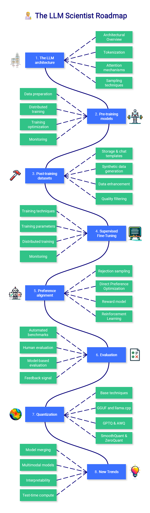

## Definitions



- **PyTorch** is one of the most popular [deep learning](https://www.datacamp.com/tutorial/tutorial-deep-learning-tutorial) frameworks, with a syntax similar to NumPy.
- In the context of PyTorch, you can think of a **Tensor** as a NumPy array that can be run on a CPU or a GPU, and has a method for automatic differentiation (needed for backpropagation).
- **TorchText, TorchVision**, and **TorchAudio** are Python packages that provide PyTorch with functionality for text, image, and audio data respectively
- A **neural network** consists of **neurons** that are arranged into **layers**. Input values are passed to the first layer of neural networks. Each neuron has two properties: a **weight** and a **bias**. The output of a neuron in a neural network is a weighted sum of its inputs, plus the bias. The output is passed on to any connected neurons in the next layer, and this continues until the final layer of the network is reached.
- An **activation function** is a transformation of the output from a neuron, and is used to introduce non-linearity into the calculations.
- **Backpropagation** is an algorithm used to train neural networks by iteratively adjusting the weights and biases of each neuron.
- **Saturation** is when the output from a neuron reaches a maximum or minimum value beyond which it cannot change. This can reduce learning performance, and an activation function such as ReLU may be needed to avoid the phenomenon.
- The **loss function** quantifies the difference between the predicted output of a model and the actual target output
- The **optimizer** is an algorithm to adjust the parameters (neuron weights and biases) of a neural network during the training process in order to minimize the loss function.
- The **learning rate** controls the step size of the optimizer. If the learning rate is too low the optimization will take too long. If it is too high, the optimizer will not effectively minimize the loss function leading to poor predictions.
- **Momentum** controls the inertia of the optimizer. If momentum is too low, the optimizer can get stuck at a local minimum and give the wrong answer. If it is too high, the optimizer can fail to converge and not give an answer.
- **Transfer learning** is reusing a model trained on one task for a second similar task to accelerate the training process.
- **Fine-tuning** is a type of transfer learning where early layers are frozen, and only the layers close to the output are trained.
- **Accuracy** is a metric to determine how well a model fits a dataset. It quantifies the proportion of correctly predicted outcomes (either classifications or predictions) compared to the total number of data points in the dataset.

## Importing PyTorch

```python
# Import the top-level package for core functionality
import torch

# Import neural network functionality
from torch import nn

# Import functional programming tools
import torch.nn.functional as F

# Import optimization functionality
import torch.optim as optim

# Import dataset functions
from torch.utils.data import TensorDataset, DataLoader

# Import evaluation metrics
import torchmetrics

```

## Working with Tensors

```python
# Create tensor from list with tensor()
tnsr = torch.tensor([1, 3, 6, 10])

# Get data type of tensor elements with .dtype
tnsr.dtype # Returns torch.int64

# Get dimensions of tensor with .Size()
tnsr.shape # Returns torch.Size([4])

# Get memory location of tensor with .device
tnsr.device # Returns cpu or gpu

# Create a tensor of zeros with zeros()
tnsr_zrs = torch.zeros(2, 3)

# Create a random tensor with rand()
tnsr_rndm = torch.rand(size=(3, 4)) # Tensor has 3 rows, 4 columns
```

## **Datasets and Dataloaders**

```python
# Create a dataset from a pandas DataFrame with TensorDataset()
X = df[feature_columns].values
y = df[target_column].values
dataset = TensorDataset(torch.tensor(X).float(), torch.tensor(y).float())

# Load the data in batches with DataLoader()
dataloader = DataLoader(dataset, batch_size=n, shuffle=True)
```

## **Preprocessing**

```python
# One-hot encode categorical variables with one_hot()
F.one_hot(torch.tensor([0, 1, 2]), num_classes=3) # Returns tensor of 0s and 1s
```

## **Sequential Model Architecture**

```python
# Create a linear layer with m inputs, n outputs with Linear()
lnr = nn.Linear(m, n)

# Get weight of layer with .weight
lnr.weight

# Get bias of layer with .bias
lnr.bias

# Create a sigmoid activation layer for binary classification with Sigmoid()
nn.Sigmoid()

# Create a softmax activation layer for multi-class classification with Softmax()
nn.Softmax(dim=-1)

# Create a rectified linear unit activation layer to avoid saturation with ReLU()
nn.ReLU()

# Create a leaky rectified linear unit activation layer to avoid saturation with LeakyReLU()
nn.LeakyReLU(negative_slope=0.05)

# Create a dropout layer to regularize and prevent overfitting with Dropout()
nn.Dropout(p=0.5)

# Create a sequential model from layers
model = nn.Sequential(
    nn.Linear(n_features, i),
    nn.Linear(i, j),   # Input size must match output from previous layer
    nn.Linear(j, n_classes),
    nn.Softmax(dim=-1) # Activation layer comes last
)
```

## Fitting a model and calculating loss

```python
# Fit a model to input data with model where model is a variable created by, e.g., Sequential()
prediction = model(input_data).double()

# Get target values
actual = torch.tensor(target_values).double()

# Calculate the mean-squared error loss for regression with MSELoss()
mse_loss = nn.MSELoss()(prediction, actual) # Returns tensor(x) 

# Calculate the L1 loss for robust regression with SmoothL1Loss()
l1_loss = nn.SmoothL1Loss()(prediction, actual) # Returns tensor(x) 

# Calculate binary cross-entropy loss for binary classification with BCELoss()
bce_loss = nn.BCELoss()(prediction, actual) # Returns tensor(x) 

# Calculate cross-entropy loss for multi-class classification with CrossEntropyLoss()
ce_loss = nn.CrossEntropyLoss()(prediction, actual) # Returns tensor(x) 

# Calculate the gradients via backprogagation with .backward()
loss.backward()
```

## Working with Optimizers

```python
# Create a stochastic gradient descent optimizer with SGD(), setting learning rate and momentum
optimizer = optim.SGD(model.parameters(), lr=0.01, momentum=0.95)

# Update neuron parameters with .step()
optimizer.step()
```

## The Training Loop

```python
# Set model to training mode
model.train()
# Set a loss criterion and an optimizer
loss_criterion = nn.MSELoss()
optimizer = optim.SGD(model.parameters(), lr=0.01, momentum=0.95)
# Loop over chunks of data in the training set
for data in dataloader:
    # Set the gradients to zero with .zero_grad()
    optimizer.zero_grad()
    # Get features and targets for current chunk of data
    features, targets = data
    # Run a "forward pass" to fit the model to the data
    predictions = model(data)
    # Calculate loss
    loss = loss_criterion(predictions, targets)
    # Calculate gradients using backprogagation
    loss.backward()
    # Update the model parameters
    optimizer.step()
```

## The Evaluation Loop

```python
# Set model to evaluation mode
model.eval()

# Create accuracy metric with Accuracy()
metric = torchmetrics.Accuracy(task="multiclass", num_classes=3)
# Loop of chunks of data in the validation set
for i, data in enumerate(dataloader, 0):
    # Get features and targets for current chunk of data
    features, targets = data
    # Run a "forward pass" to fit the model to the data
    predictions = model(data)
    # Calculate accuracy over the batch
    accuracy = metric(output, predictions.argmax(dim=-1))
# Calculate accuracy over all the validation data
accuracy = metric.compute()
print(f"Accuracy on all data: {accuracy}")
# Reset the metric for the next dataset (training or validation)
metric.reset()
```

## Transfer Learning and Fine-Tuning

```python
# Save a layer of a model to a file with save()
torch.save(layer, 'layer.pth')

# Load a layer of a model from a file with load()
new_layer = torch.load('layer.pth')

# Freeze the weight for layer 0 with .requires_grad
for name, param in model.named_parameters():
    if name == "0.weight":
        param.requires_grad = False
```


```
conda create -n torch python=3.10
conda activate torch
pip install torch
pip install torchvision
pip install visdom
pip install tensorboard
pip install tensorboardX

cd /Users/linghuang/Git/Deep-Learning/PyTorch/03/log
tensorboard --logdir ./
```

### Disclaimer

This repository and its contents are collected and shared solely for academic and research purposes. All code, data, and related materials are intended to support independent study, experimentation, and learning.

If you believe any part of this repository inadvertently includes content that should not be shared publicly or may cause concern, please contact me immediately. I will review and, if necessary, remove the material without delay.

I do not claim ownership of any third-party data or content and have made every effort to respect intellectual property and privacy rights.